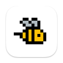

# [](https://github.com/leonardodino/BeezyLight/releases/latest/download/BeezyLight.zip)&nbsp;BeezyLight.app

#### tiny macOS app to control a [usb-connected light](https://www.blinkstick.com/products/blinkstick-square)

lights up whenever there's a microphone is in use

> most conferencing apps keep the audio input active even when muted this app will then work as an accurate "at a meeting" indicator :technologist:

#### ✦&ensp; features:
- [x] :sparkles: no setup, configs, drivers or persistent system changes
- [x] :studio_microphone: single menubar icon to show mic state / quit
- [x] :floppy_disk: native build, fits in a floppy, minimal resource usage

#### ✦&ensp;install:
1. download lastest version [**here**](https://github.com/leonardodino/BeezyLight/releases/latest/download/BeezyLight.zip)
2. unzip and move `BeezyLight.app` to `/Applications`
3. add to [**Login Items**](https://support.apple.com/en-gb/guide/mac-help/mh15189/mac) to launch it automatically after login in **(optional)**
